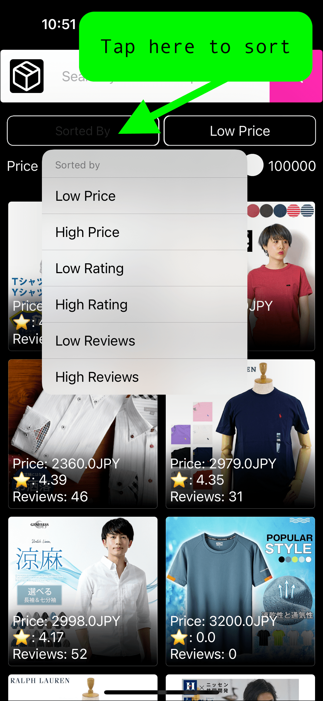

# GigaShop - Product Search Engine

This Product Search App allows users to search for products. Users can filter and sort their search results and view detailed product information.

## Features

- **Search Functionality:** Users can search for products using keywords.
- **Filtering:** Users can filter search results based on price range.
- **Sorting:** Users can sort search results by price, rating, and review count.
- **Product Details:** Users can view detailed information about each product.

## Installation

To install the app, follow these steps:

1. Clone the repository to your local machine.
2. Open the project in Xcode.
3. Build and run the app on a simulator or a physical device.

## Usage

1. Upon launching the app, you'll be presented with a search bar.
2. Enter a keyword in the search bar and tap the search button to fetch products related to the keyword.
3. Use the filter options to narrow down your search results based on price range.
4. Use the sorting options to arrange your search results by price, rating, or review count.
5. Scroll through the products list to view your searched products.
6. Tap on a product to view detailed information about it.

    
    

## Requirements

- iOS 15.0+
- Xcode 15.0+
- Swift 5.0+

## Contact

For any questions or inquiries, please contact **mahfujulislam2014@gmail.com**, **+88-01775657897**.

**Note**: This README provides a brief overview of the app. For detailed technical documentation, refer to the code comments and documentation within the project files.
